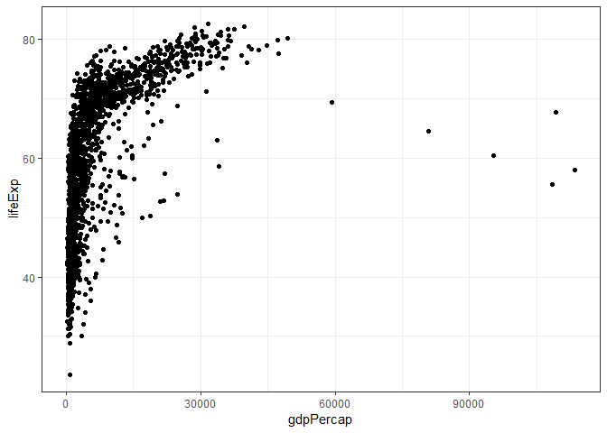

In this illustration, the Gapminder package is used for plotting charts.  This data set comes with six variables including country, continent, year, life expectancy, population and GDP per capita. 

Let's install the package, load the data and examine the dataset:

```r
install.packages("gapminder", repos = "https://cran.r-project.org")
library(gapminder)
```

```
## Warning: package 'gapminder' was built under R version 3.5.3
```

```r
summary(gapminder) # Summary of Gapminder dataset
str(gapminder) # Structure of dataset

gm=gapminder
head(gm)
summary(gm)
```


Simple Scatterplot:


```r
library(ggplot2)
```

```
## Warning: package 'ggplot2' was built under R version 3.5.3
```

```r
p <- ggplot(data = gm,
            mapping = aes(x = gdpPercap,
                          y = lifeExp))  # Shows nothing. Why?
p + geom_point() +
  theme_bw()
```

<!-- -->

First, we need to start the data component, then add the aesthetic mapping defining the basics (i.e. variables), followed by the geometric objects.  Here is an alternative: 


```r
# Alternative
p <- ggplot(data=gm, aes(x=gdpPercap, y=lifeExp))
```

What is still missing?


```r
p + geom_point()
```

<!-- -->

Now, we can add more features to the chart.


```r
# Add some color grouping
p <- ggplot(data = gm,
            mapping = aes(x = gdpPercap,
                          y = lifeExp, color=continent))
p + geom_point()
```

<!-- -->
Now you can knit the Markdown file and publish it to either Rpub or your own github website!
